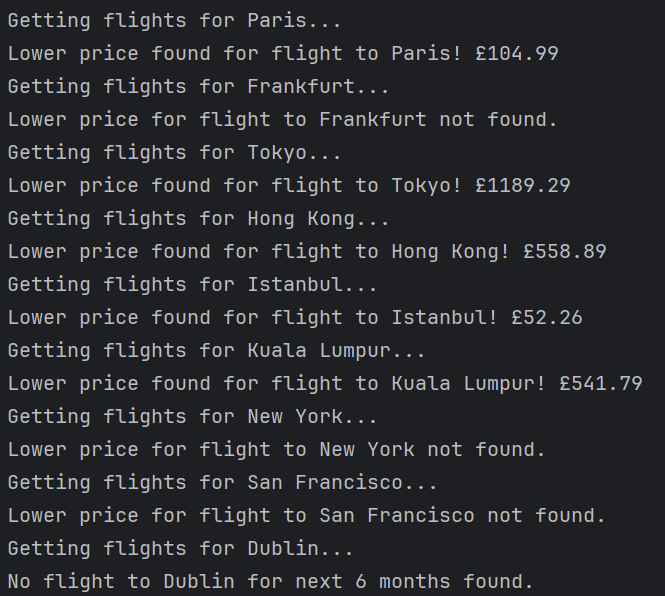

# Day 39

Capstone Project for finding lower prices for flight from London to various cities. 
Put knowledge of using requests module, authenticating and sending API requests to Sheety and Amadeus. 
Applied OOP, and used python3-dotenv and datetime modules. 
Still could not use Twilio, so used email instead.

